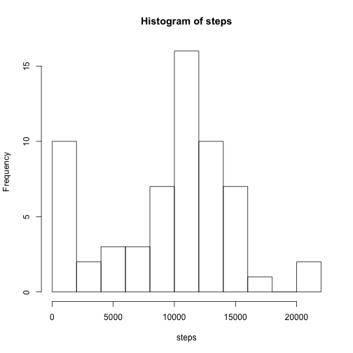
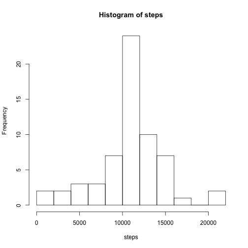
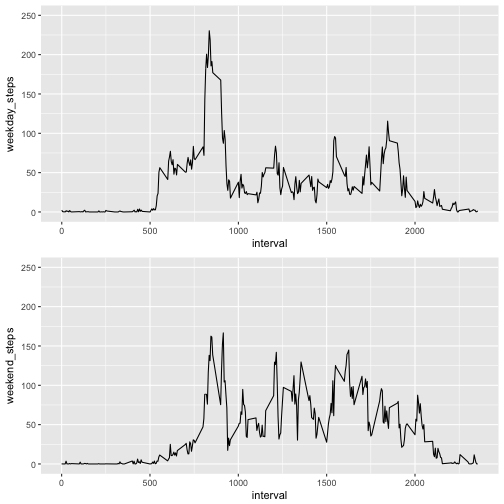

#Reproducible Research Project 1
David MacGregor

##Get data
Downloading the data using the downloader package, and then unzipping it.


```r
library(downloader)
    download("https://d396qusza40orc.cloudfront.net/repdata%2Fdata%2Factivity.zip", "activity.zip")
    unzip("activity.zip")
```
##Loading and preprocessing the data.


```r
activedata<-read.csv("activity.csv")
library(lubridate)
```

```
## 
## Attaching package: 'lubridate'
```

```
## The following object is masked from 'package:base':
## 
##     date
```

```r
    activedata$date<-ymd(activedata$date)
```
##What is mean total number of steps taken per day?
1. Calculate the total number of steps taken per day

```r
q1data<-with(activedata, aggregate(steps, list(date=date), sum, na.rm=TRUE))
```
2. Make a histogram of the total number of steps taken each day

```r
colnames(q1data)= c("date", "steps")
with(q1data, hist(steps, breaks=10))
```



3. Calculate and report the mean and median of the total number of steps taken per day

```r
stepsmean<-round(with(q1data, mean(steps)), 2)
stepsmedian<-with(q1data, median(steps))
```
The mean of steps per day is **9354.23**, and the median is **10395**.

##What is the average daily activity pattern?
1. Make a time series plot (i.e. type = "l") of the 5-minute interval (x-axis) and the average number of steps taken, averaged across all days (y-axis)


```r
intervalave<-with(activedata, aggregate(steps, list(interval=interval), mean, na.rm=TRUE))
colnames(intervalave)= c("interval", "steps")
with(intervalave, plot(interval, steps, type="l"))
```


2. Which 5-minute interval, on average across all the days in the dataset, contains the maximum number of steps?


```r
intervalmax<-intervalave[which.max(intervalave$steps),1]
```
The interval with the maximum number of steps is **835**.

##Imputing missing values
1. Calculate and report the total number of missing values in the dataset (i.e. the total number of rows with NAs)

```r
missingrows<-sum(is.na(activedata$steps))
```
The total number of missing values is **2304**.

2. Devise a strategy for filling in all of the missing values in the dataset. The strategy does not need to be sophisticated. For example, you could use the mean/median for that day, or the mean for that 5-minute interval, etc.

*In the next step, I'll create a dataset that replaces missing data with the average for that interval, using the values I calculated for the average daily activity pattern.*

3. Create a new dataset that is equal to the original dataset but with the missing data filled in.


```r
activedataimpute<-activedata

##This for loop goes through the data frame row by row, checks if the steps data is missing, and if it is, replaces the missing data with the average for the interval.
for (i in 1:length(activedataimpute$steps)){
     if (!is.na(activedataimpute[i,1])){
        next
     }
    curinterval<-activedataimpute[i,3]
    searchrow<-which(intervalave$interval==curinterval)
    steps<-intervalave[searchrow,2]
    activedataimpute[i,1]=steps
}

##I'm including the next step so that you can check if my for loop works correctly.
head(activedataimpute)
```

```
##       steps       date interval
## 1 1.7169811 2012-10-01        0
## 2 0.3396226 2012-10-01        5
## 3 0.1320755 2012-10-01       10
## 4 0.1509434 2012-10-01       15
## 5 0.0754717 2012-10-01       20
## 6 2.0943396 2012-10-01       25
```
4. Make a histogram of the total number of steps taken each day and Calculate and report the mean and median total number of steps taken per day. 

```r
histdata<-with(activedataimpute, aggregate(steps, list(date=date), sum, na.rm=TRUE))
colnames(histdata)= c("date", "steps")
with(histdata, hist(steps, breaks=10))
```



```r
imputestepsmean<-round(with(histdata, mean(steps)), 2)
imputestepsmedian<-round(with(histdata, median(steps)), 2)
```


```r
print(paste("Mean number of steps after imputation: ", imputestepsmean))
```

```
## [1] "Mean number of steps after imputation:  10766.19"
```

```r
print(paste("Median number of steps after imputation: ", imputestepsmedian))
```

```
## [1] "Median number of steps after imputation:  10766.19"
```
Q: Do these values differ from the estimates from the first part of the assignment?

A: Yes.


```r
diffmean<-imputestepsmean - stepsmean
diffmedian<-imputestepsmedian - stepsmedian
```

Q: What is the impact of imputing missing data on the estimates of the total daily number of steps?

A. The mean number of steps increased by 1411.96 and the median number increased by 371.19. Also, the data became less skewed, as the mean now equals the median.

##Are there differences in activity patterns between weekdays and weekends?

1. Create a new factor variable in the dataset with two levels – “weekday” and “weekend” indicating whether a given date is a weekday or weekend day.


```r
weekendcheck<-c("Saturday", "Sunday")
activedataimpute$weekday<-factor((weekdays(activedataimpute$date) %in% weekendcheck), levels=c(FALSE, TRUE), labels=c('weekday', 'weekend'))
```
2. Make a panel plot containing a time series plot (i.e. type = "l") of the 5-minute interval (x-axis) and the average number of steps taken, averaged across all weekday days or weekend days (y-axis).

```r
library(ggplot2)
library(gridExtra)
splitdata<-split(activedataimpute, activedataimpute$weekday)
weekenddata<-with(splitdata$weekend, aggregate(steps, list(interval=interval), mean))
weekdaydata<-with(splitdata$weekday, aggregate(steps, list(interval=interval), mean))
alldata<-merge(weekenddata, weekdaydata, by.x="interval", by.y="interval")
colnames(alldata)<-c("interval", "weekend_steps", "weekday_steps")
pl1<-ggplot(data=alldata, aes(interval, weekday_steps))+ geom_line() +ylim(0,250)
pl2<-ggplot(data=alldata, aes(interval, weekend_steps))+ geom_line() +ylim(0,250)
grid.arrange(pl1, pl2, ncol=1)
```


